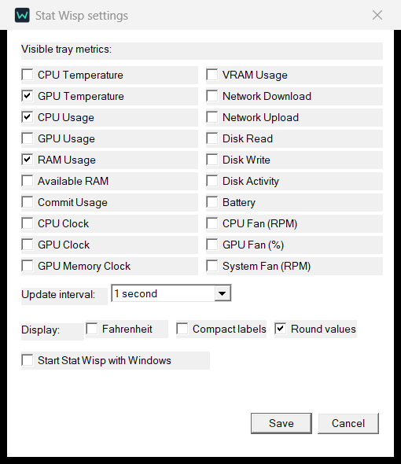

# Stat Wisp

Your PC's vitals, quietly in the Windows tray.

Show temperatures, usage, memory, fan speeds, clocks, network, disk, and battery readings. Pick the icons you want; right-click any icon to change settings. Temperature colors go from green to amber to red.

[Download the latest release](https://github.com/grayfvll01/stat-wisp/releases/latest) · [Sensor support](docs/sensor-support.md)

Windows 10/11, x64. Small native app, no telemetry, no bundled drivers. CPU temperature requires LibreHardwareMonitor or OpenHardwareMonitor with WMI enabled; unavailable readings show `--`.

Free and open source under the [MIT License](LICENSE). [Build from source](docs/development.md).
